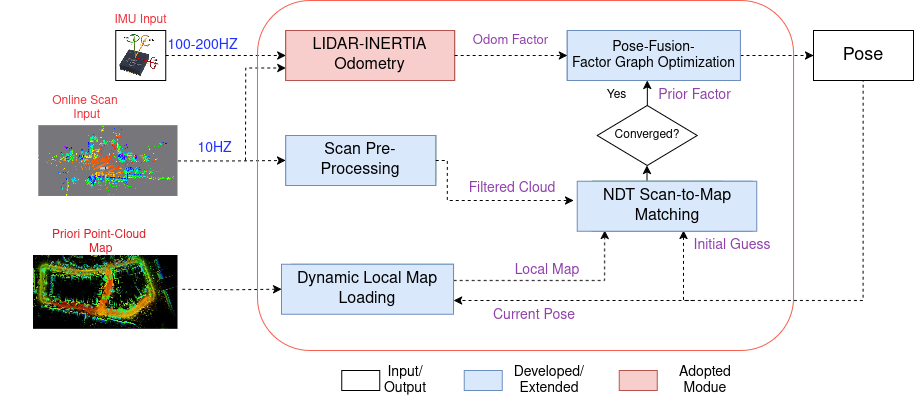

## LiDAR-Inertial-Re-Localization

## Motivation 
Autonomous robots require accurate localization in GPS-denied environments like
indoors or urban canyons.GNSS-INS systems are prone to failure in these conditions,
while real-time SLAM often drift without loop closures
Map-based localization offers a stable and accurate alternative, but it faces several
key challenges:

1. <strong>Real-time performance and Scalability</strong>: Handling high-resolution 3D maps and
    computing scan-to-map registration efficiently.

2. <strong>Drift correction</strong>: Fusing local motion estimation with global map constraints while
preserving consistency.

This project presents a robust and real-time localization framework for GNSS-denied
environments by fusing LiDAR-Inertial Odometry (FAST-LIO2) with multithreaded
NDT-based map matching using a sliding-window factor graph.
The system achieves centimeter- to decimeter-level accuracy
across diverse datasets, maintaining low-latency performance suitable for real-
world autonomous navigation. 

## Methodology 

<div style="display:flex;justify-content:center;">
  <div style="flex:1; margin-right:10px;
              background-color:#fff;   /* <-- make the bg opaque */
              padding:8px;             /* optional border/padding */
              box-shadow:0 0 4px rgba(0,0,0,0.2); /* optional */
              ">
    
    <p style="text-align:center;">Figure 1: Complete Diagram of The Localization System</p>
  </div>
</div>


Installation

```
cd ~/ros2_ws/src
git clone git@github.com:eliyaskidnae/Robust-LiDAR-Inertial-Re-Localization.git
cd ~/ros2_ws
colcon build --symlink-install --cmake-args -DCMAKE_BUILD_TYPE=Release

```

save the map file (map/map.pcd) to the map/ directory.

Running the system

```
source ~/ros2_ws/install/setup.bash
source /install/setup.bash
ros2 launch fast_lio mapping.launch.py config_file:='ouster64.yaml' #run FAST-LIO2 odometry
ros2 launch lidar_localization_ros2 lidar_localization.launch.py #run scan to map localization
ros2 launch lidar_localization_ros2 fusion.launch.py #run the fusion of FAST-LIO2 and scan to map localization
```
## 📹 Demo Video

[](https://www.youtube.com/watch?v=dNa92Y9yDuk)

Click the image above or [watch the demo on YouTube](https://www.youtube.com/watch?v=dNa92Y9yDuk).
